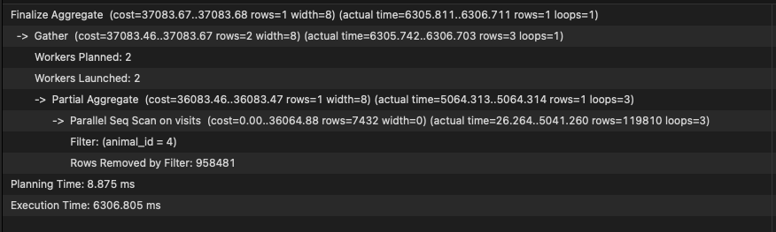
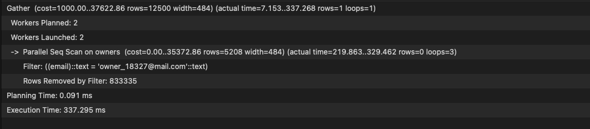
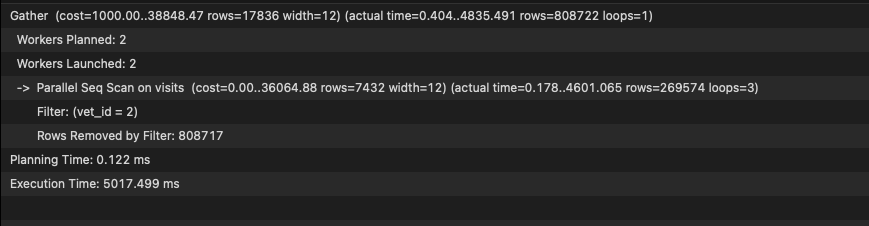
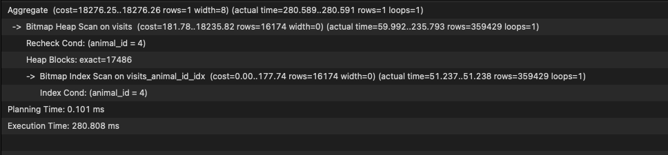
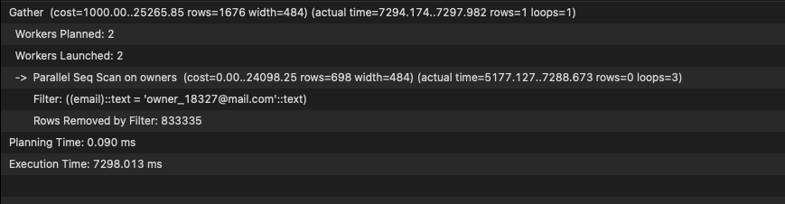
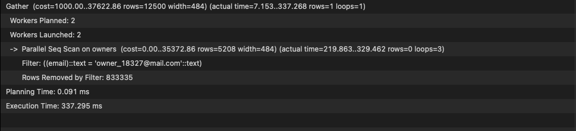

# Vet clinic database

> This repo constains files required to create a db for the vet clinic project.

## Getting Started

This repository includes files with plain SQL that can be used to recreate a database:

- Use [schema.sql](./schema.sql) to create all tables.
- Use [data.sql](./data.sql) to populate tables with sample data.
- Check [queries.sql](./queries.sql) for examples of queries that can be run on a newly created database. **Important note: this file might include queries that make changes in the database (e.g., remove records). Use them responsibly!**

## Performance Checks

### Query `EXPLAIN ANALYZE SELECT COUNT(*) FROM visits where animal_id = 4;`
#### Before

#### After

### Query `EXPLAIN ANALYZE SELECT * FROM visits where vet_id = 2;`
#### Before

#### After

### Query `EXPLAIN ANALYZE SELECT * FROM owners where email = 'owner_18327@mail.com';`
#### Before

#### After

## Tools Used
- PostgreSQL
- Postgresapp
- TablePlus

## Authors

👤 **Daniel M. Matongo**

- GitHub: [@mmatongo](https://github.com/mmatongo)
- LinkedIn: [Daniel M. Matongo](https://linkedin.com/in/mmatongo)

## 🤝 Contributing

Contributions, issues, and feature requests are welcome!

Feel free to check the [issues page](../../issues/).

## Show your support

Give a ⭐️ if you like this project!

## Acknowledgments

- Hat tip to anyone whose code was used
- Inspiration
- etc

## 📝 License

This project is [MIT](./MIT.md) licensed.
